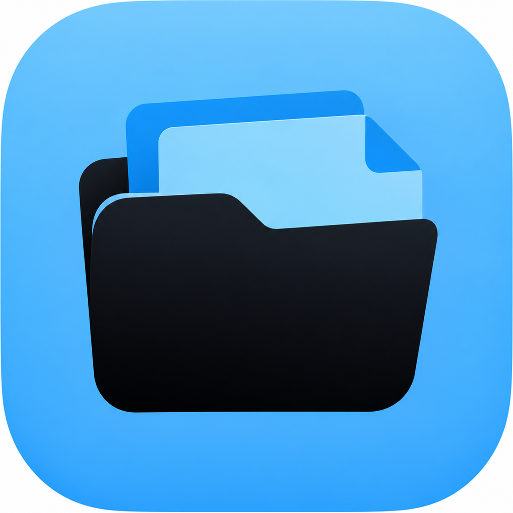

<p align="center">
  
</p>

<h1 align="center">FileManager</h1>

<p align="center">
  A local file manager for iOS that actually does the things Apple's Files app won't.
</p>

<p align="center">
  
  
  
</p>

---

Files apps on iOS are fine for browsing, but the moment you want to actually *protect* something — a real password on a PDF, an encrypted zip, a folder nobody but you can open — you're stuck. FileManager is my answer to that: a sideloaded, no-account, no-backend file manager that treats security features as first-class, not an afterthought.

Everything runs on-device. There's no server, no analytics, no account. The only thing FileManager will ever reach out to the internet for is an *optional*, manual check against this repo's GitHub releases from the Settings tab — nothing else, ever.

## What it does

**Files & folders** — the basics, done properly: create folders and files (with real content, not just empty placeholders), edit text files in place, rename anything (including swapping the extension, `.txt` → `.pdf`, whatever), multi-select, delete, browse. Tapping a file opens it — a Quick Look preview for most things (including audio and video, like `.mp3`/`.mp4`/`.wav`), a plain-text editor for `.txt`. An "Import File" button pulls in any file type from Files, iCloud Drive, or any other app's document provider.

**Hidden & Face ID–locked folders** — mark a folder "hidden" and it's gone from normal browsing, only reachable from its own dedicated area. Separately, lock any folder behind Face ID / passcode. The two are independent, so you can mix and match.

**Share Sheet support** — FileManager shows up when you tap Share in any other app. Send a file over, then open FileManager to finish bringing it into My Files. (This deliberately doesn't rely on an App Group, since that needs a real, fully provisioned Apple Developer account — the extension hands files to the app over a named pasteboard instead, so it works with any signing setup.)

**ZIP, with real encryption** — create and extract zip archives from anything in the app. Password-protect them with AES-256. (`ZIPFoundation` doesn't support encrypted zips natively, so files are individually encrypted with `CryptoKit` before they ever get zipped.)

**Encrypt literally anything** — PDFs and ZIPs get their own proper encryption schemes (see below), and every other file type — photos, text, whatever — can be encrypted with a password straight from its context menu, using AES-GCM.

**A dedicated PDF Creator tab** — combine photos from your library, images already sitting in your vault, a document scan, or typed text into a PDF, without having to dig through folders first.

**Real PDF passwords** — lock a PDF with a real owner/user password through `PDFKit` — the kind of protection that works when you open the file in *any* PDF reader, not just this app.

**Settings — pick your look** — four built-in themes (light blue/black, red/black, light blue/white, red/white), plus a one-tap check against this repo's latest release so you know when to update.

**Speaks your language** — the UI follows your device's system language. Currently English and German; PRs for more are welcome.

## Screenshots

*(coming soon — open an issue or PR if you'd like to contribute some)*

## Getting it running

You'll need a Mac with Xcode and [XcodeGen](https://github.com/yonaskolb/XcodeGen) (the `.xcodeproj` isn't committed — it's generated from `project.yml`):

```bash
brew install xcodegen
git clone https://github.com/xsxs18-dev/FileManager.git
cd FileManager
xcodegen generate
open FileManager.xcodeproj
```

Set your own signing team in Xcode and build to a device.

### Don't have Xcode?

Every push to `main` builds an **unsigned** `.ipa` on GitHub Actions and publishes it straight to a new [Release](https://github.com/xsxs18-dev/FileManager/releases) — one release per build, tagged `build-N`, with the raw `.ipa` attached as a downloadable asset (not zipped, unlike the Actions artifact tab). Grab the latest one and sign it with your own free (or paid) Apple ID using:

- [Sideloadly](https://sideloadly.io/), or
- [AltStore](https://altstore.io/) — handles the 7-day re-signing free accounts need automatically

## How it's built

| | |
|---|---|
| UI | SwiftUI everywhere, except where iOS forces UIKit (the document scanner, the Share Extension host) |
| PDF | `PDFKit` — creation, rendering, and real owner/user password encryption |
| ZIP | [`ZIPFoundation`](https://github.com/weichsel/ZIPFoundation) for archiving, `CryptoKit` (AES-GCM) for encryption |
| Generic file encryption | `CryptoKit` (AES-GCM), salted per file, `.fvenc` output |
| Face ID | `LocalAuthentication` |
| Localization | a String Catalog (`Localizable.xcstrings`), English source + German |
| App ↔ Share Extension | a named `UIPasteboard` + a custom URL scheme (`filemanager://`), no App Group, no entitlements at all |

```
FileManager/
├── App/            entry point
├── DesignSystem/   colors, spacing, type, theme definitions, shared styles
├── Models/         FileItem, ZipManifest
├── Services/       FileSystemService, ZipService, PDFService, CryptoService,
│                   FileEncryptionService, AuthenticationService,
│                   FolderProtectionStore, ThemeManager, UpdateChecker
├── Shared/         PendingImportStore, shared with the extension
├── Views/          screens and sheets (Files tab, PDF Creator tab, Settings tab, ...)
└── Resources/      Assets.xcassets, Info.plist, Localizable.xcstrings

ShareExtension/     the Share Sheet extension target
project.yml         XcodeGen project definition
.github/workflows/  CI — builds an unsigned .ipa and cuts a GitHub Release for every push
```

## Known rough edges

- Sharing a file in doesn't let you pick a destination folder anymore — it always lands in My Files, and you have to open FileManager afterwards for it to actually show up. That's the tradeoff for not needing an App Group (and therefore not needing a real, fully provisioned Apple Developer account) to make the Share Extension work.
- The Share Extension's own UI is English-only for now, regardless of your system language — only the main app is localized.
- No landscape-optimized layout yet.
- No iPad-specific split view.

Contributions and bug reports welcome — this is a small side project, not a polished product, and it'll stay that way unless people find it useful enough to push on.

## License

MIT — see [LICENSE](LICENSE). Do whatever you want with it.
