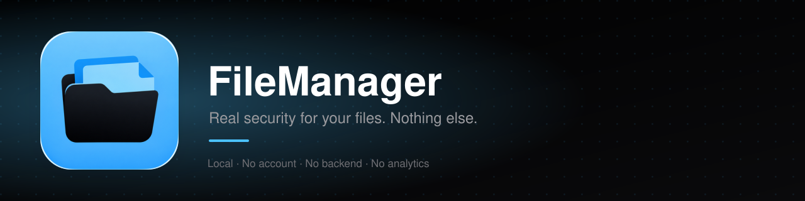

<p align="center">
  
</p>

<p align="center">
  
  
  
  
  
  
</p>

<p align="center">
  
  
  
  
  
  
  
</p>

Files apps on iOS are fine for browsing, but the moment you want to actually *protect* something — a real password on a PDF, an encrypted zip, a folder nobody but you can open — you're stuck. FileManager is my answer to that: a sideloaded, no-account, no-backend file manager that treats security features as first-class, not an afterthought.

Everything runs on-device. There's no server, no analytics, no account. The only thing FileManager will ever reach out to the internet for is an *optional*, manual check against this repo's GitHub releases from the Settings tab — nothing else, ever.

## Contents

- [What it does](#what-it-does)
  - [Files and Folders](#files-and-folders)
  - [Hidden and Face ID-Locked Folders](#hidden-and-face-id-locked-folders)
  - [A Second, Hidden Vault](#a-second-hidden-vault)
  - [Self-Destructing Folders](#self-destructing-folders)
  - [Share Sheet Support](#share-sheet-support)
  - [ZIP with Real Encryption](#zip-with-real-encryption)
  - [Encrypt Anything](#encrypt-anything)
  - [PDF Creator](#pdf-creator)
  - [Real PDF Passwords](#real-pdf-passwords)
  - [Secure Delete](#secure-delete)
  - [Themes and Settings](#themes-and-settings)
  - [Localization](#localization)
- [Screenshots](#screenshots)
- [Getting it running](#getting-it-running)
  - [Don't have Xcode?](#dont-have-xcode)
  - [Or add it as an AltStore source](#or-add-it-as-an-altstore-source)
- [How it's built](#how-its-built)
- [Known rough edges](#known-rough-edges)
- [License](#license)

## What it does

### Files and Folders

The basics, done properly: create folders and files (with real content, not just empty placeholders), edit text files in place, rename anything (including swapping the extension, `.txt` → `.pdf`, whatever), multi-select, delete, browse. Tapping a file opens it — a Quick Look preview for most things (including audio and video, like `.mp3`/`.mp4`/`.wav`), a plain-text editor for `.txt`. An "Import File" button pulls in any file type from Files, iCloud Drive, or any other app's document provider, and "Import Photo" pulls photos and videos straight from your photo library through Apple's picker — no photo library permission needed, since the system hands over only what you actually pick. Move or copy a file into any other folder (hidden and locked folders never show up as destinations), or hand it off to any other app through the system share sheet — one at a time or with a whole multi-selected batch.

### Hidden and Face ID-Locked Folders

Mark a folder "hidden" and it's gone from normal browsing, only reachable from its own dedicated Hidden Area. Separately, lock any folder behind Face ID / passcode. The two are independent, so you can mix and match. The Hidden Area itself isn't read-only either — rename, move, copy, lock/unlock, unhide, and delete all work there too, individually or as a multi-selected batch.

### A Second, Hidden Vault

Tap the gear icon at the top of Settings **seven times** to reveal a completely separate, Face ID-only vault. It's stored apart from the regular one and isn't referenced anywhere else in the UI — the seven taps are the only way in. The very first time you unlock it, you're asked to set the self-destruct limit below (you can skip it and leave it at "Never").

### Self-Destructing Folders

Set a number of failed Face ID attempts (3, 5, or 10) after which a locked folder — or the secret vault — deletes itself automatically. A cancelled prompt never counts against the limit, only a genuine wrong attempt does. This isn't a normal Settings row: it's only ever asked once, when the secret vault is first created, and after that the only way back into it is tapping "Version" in Settings **ten times** — so it can't just be switched off by anyone who happens to have your phone unlocked.

### Share Sheet Support

FileManager shows up when you tap Share in any other app. Send a file over, then open FileManager to finish bringing it in. (This deliberately doesn't rely on an App Group, since that needs a real, fully provisioned Apple Developer account — the extension hands files to the app over the system clipboard instead, briefly, so it works with any signing setup. Named/custom pasteboards would avoid touching your actual clipboard, but Apple deprecated those for exactly this kind of app-to-extension handoff back in iOS 10.)

If you've had FileManager open recently, the share sheet also offers a destination folder picker, built the same way — the app quietly drops a list of your folder names onto the clipboard whenever it's open, and the extension reads it back. It's best-effort: without an App Group the extension can't browse your vault directly, so if that list isn't there (or the folder you picked got renamed, hidden, or deleted in the meantime), the file just falls back to landing in My Files.

### ZIP with Real Encryption

Create and extract zip archives from anything in the app. Password-protect them with AES-256. (`ZIPFoundation` doesn't support encrypted zips natively, so files are individually encrypted with `CryptoKit` before they ever get zipped.)

### Encrypt Anything

PDFs and ZIPs get their own proper encryption schemes (see below), and every other file type — photos, text, whatever — can be encrypted with a password straight from its context menu, using AES-GCM.

### PDF Creator

A dedicated tab that combines photos from your library, images already sitting in your vault, a document scan, or typed text into a PDF, without having to dig through folders first.

### Real PDF Passwords

Lock a PDF with a real owner/user password through `PDFKit` — the kind of protection that works when you open the file in *any* PDF reader, not just this app.

### Secure Delete

An opt-in toggle, visible in Settings, that overwrites a file's bytes with random data before removing it, so simple undelete/recovery tools come up empty. Off by default since it's slower, especially on large files.

### Themes and Settings

Four built-in themes (light blue/black, red/black, light blue/white, red/white), plus a one-tap check against this repo's latest release so you know when to update. Settings shows your current version and build number, and a Changelog screen lists what changed in every past release, pulled straight from GitHub Releases.

### Localization

The UI follows your device's system language. Currently English and German; PRs for more are welcome.

## Screenshots

> Coming soon — [open an issue or PR](https://github.com/xsxs18-dev/FileManager/issues) if you'd like to contribute some real device shots.

## Getting it running

You'll need a Mac with Xcode and [XcodeGen](https://github.com/yonaskolb/XcodeGen) (the `.xcodeproj` isn't committed — it's generated from `project.yml`):

```bash
brew install xcodegen
git clone https://github.com/xsxs18-dev/FileManager.git
cd FileManager
xcodegen generate
open FileManager.xcodeproj
```

Set your own signing team in Xcode and build to a device.

### Don't have Xcode?

Every push to `main` builds an **unsigned** `.ipa` on GitHub Actions and publishes it straight to a new [Release](https://github.com/xsxs18-dev/FileManager/releases) — one release per build, tagged `build-N`, with the raw `.ipa` attached as a downloadable asset (not zipped, unlike the Actions artifact tab). Grab the latest one and sign it with your own free (or paid) Apple ID using:

- [Sideloadly](https://sideloadly.io/), or
- [AltStore](https://altstore.io/) — handles the 7-day re-signing free accounts need automatically

### Or add it as an AltStore source

FileManager also publishes itself as an [AltStore](https://altstore.io/) source, so new builds show up as an update in AltStore directly instead of you having to check the Releases page by hand.

[**Tap to add the source directly**](altstore://source?url=https://raw.githubusercontent.com/xsxs18-dev/FileManager/main/altstore-source.json) (on-device, with AltStore installed), or add it manually in AltStore under **Browse → Sources → Add Source**:

```
https://raw.githubusercontent.com/xsxs18-dev/FileManager/main/altstore-source.json
```

The source file itself gets updated automatically by CI on every build, right alongside the release.

> Note: this only works with **AltStore Classic**, not AltStore PAL — PAL requires every app to pass Apple's notarization process under a paid Apple Developer account, which is exactly what this project avoids needing.

## How it's built

<p>
  
  
  
  
  
  
  
</p>

| | |
|---|---|
| UI | SwiftUI everywhere, except where iOS forces UIKit (the document scanner, the Share Extension host) |
| PDF | `PDFKit` — creation, rendering, and real owner/user password encryption |
| ZIP | [`ZIPFoundation`](https://github.com/weichsel/ZIPFoundation) for archiving, `CryptoKit` (AES-GCM) for encryption |
| Generic file encryption | `CryptoKit` (AES-GCM), salted per file, `.fvenc` output |
| Face ID | `LocalAuthentication` |
| Localization | a String Catalog (`Localizable.xcstrings`), English source + German |
| App ↔ Share Extension | the system pasteboard + a custom URL scheme (`filemanager://`), no App Group, no entitlements at all |

<details>
<summary><strong>Project layout</strong></summary>

```
FileManager/
├── App/            entry point
├── DesignSystem/   colors, spacing, type, theme definitions, shared styles
├── Models/         FileItem, ZipManifest
├── Services/       FileSystemService, ZipService, PDFService, CryptoService,
│                   FileEncryptionService, AuthenticationService,
│                   FolderProtectionStore, ThemeManager, UpdateChecker
├── Shared/         PendingImportStore, shared with the extension
├── Views/          screens and sheets (Files tab, PDF Creator tab, Settings tab, ...)
└── Resources/      Assets.xcassets, Info.plist, Localizable.xcstrings

ShareExtension/     the Share Sheet extension target
project.yml         XcodeGen project definition
.github/workflows/  CI — builds an unsigned .ipa and cuts a GitHub Release for every push
```

</details>

## Known rough edges

<details>
<summary>Click to expand</summary>

- The Share Sheet's folder picker only works if FileManager was opened recently enough for its folder list to still be on the clipboard — otherwise a shared file falls back to My Files, and you have to open FileManager afterwards for it to actually show up. That's the tradeoff for not needing an App Group (and therefore not needing a real, fully provisioned Apple Developer account) to make the Share Extension work.
- Sending a file from the Share Sheet briefly replaces whatever's on your clipboard, since that's the handoff mechanism. It gets cleared out once FileManager picks the file up.
- The Share Extension's own UI is English-only for now, regardless of your system language — only the main app is localized.
- No landscape-optimized layout yet.
- No iPad-specific split view.

</details>

Contributions and bug reports welcome — this is a small side project, not a polished product, and it'll stay that way unless people find it useful enough to push on.

## License

MIT — see [LICENSE](LICENSE). Do whatever you want with it.
